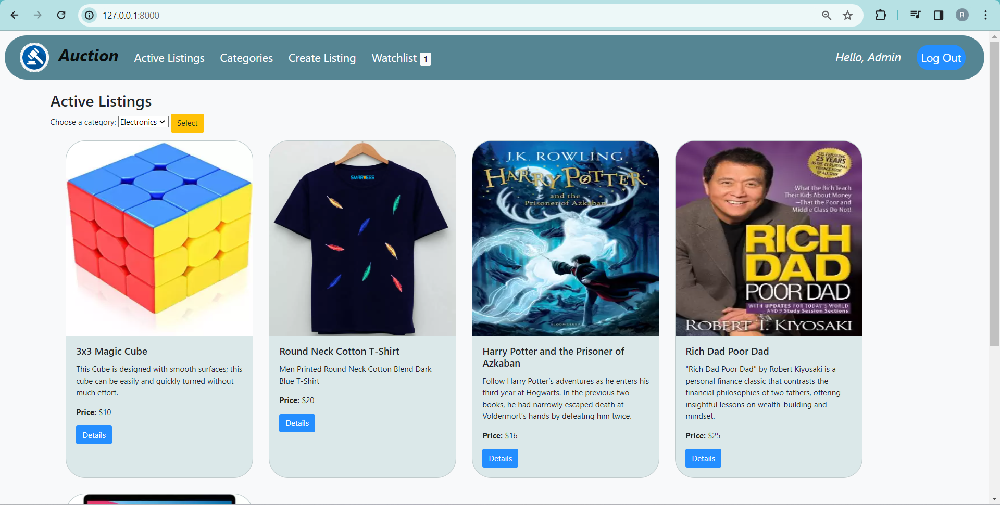
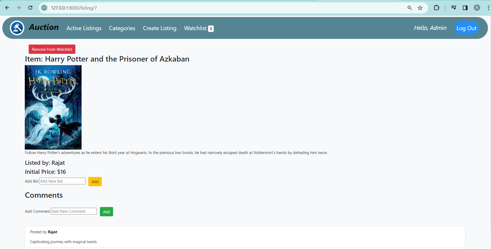
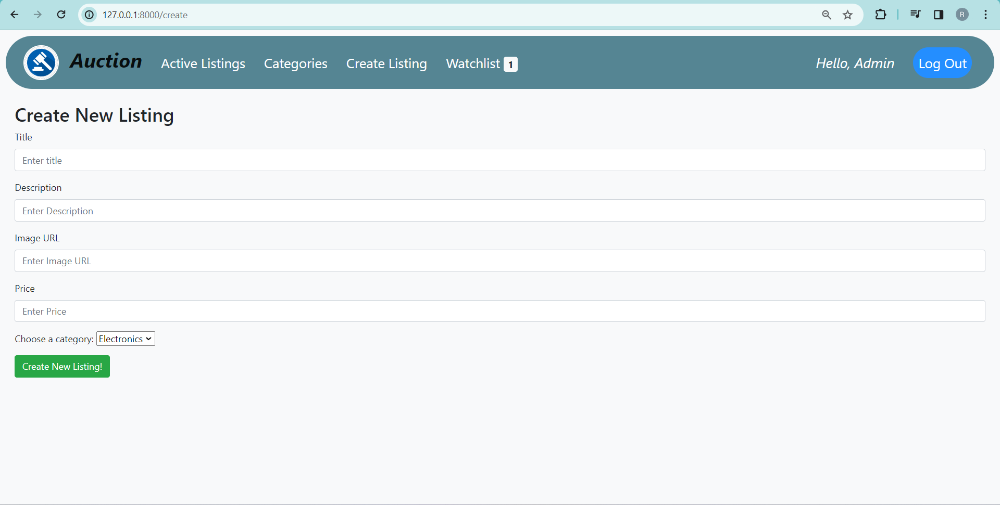

# 🌐 Auction_e-commerce 🛒🛍️👨‍⚖

Thrilled to reveal my latest coding journey – the **Auction_e-commerce Project!** 🌐💻
Immerse yourself in the dynamic world of online auctions with this vibrant Django-powered website! 🛍️✨ Picture building your own eBay-like e-commerce platform as we delve into the fascinating realm of web development.

## Overview

This web application allows you to perform the following actions:

- Add new items to the auction
- View detailed information about listed items
- Explore the home page for a snapshot of current auctions
- Dive into the CS50 Commerce project by watching the [YouTube tutorial](https://www.youtube.com/watch?v=ZrYe9GElEEE&t=11s)

## How to Use

1. Clone this repository to your local machine.
2. Install the necessary dependencies by running `npm install`.
3. Run the application locally using `npm start`. The app will open in your web browser at [http://localhost:8000](http://localhost:8000).
4. Follow the on-screen instructions to participate in or manage auctions.

## Screenshots

### Home Page

### Listed Item Detail

### Create New Item

## YouTube Tutorial

Watch the YouTube tutorial to learn how to set up and use this project. The tutorial provides a step-by-step guide on running the application and managing auctions.

## Deployment

To deploy this application for production, use the `npm run build` command, generating a production-ready build in the `build` folder.

## Additional Information

For more details, refer to the [Create React App documentation](https://facebook.github.io/create-react-app/docs/getting-started) and [React documentation](https://reactjs.org/).

## Troubleshooting

If you encounter any issues, please check the troubleshooting guide provided in the Create React App documentation.
